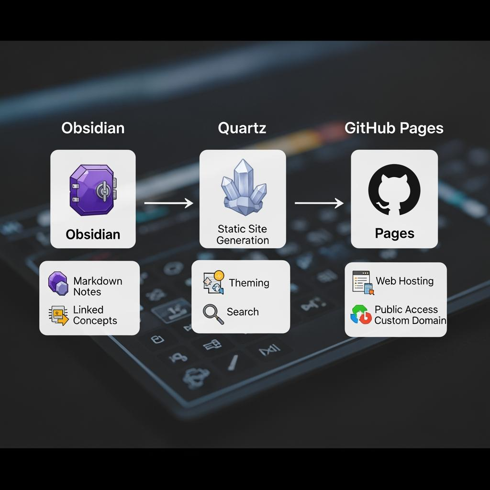
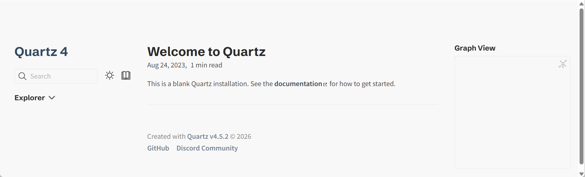
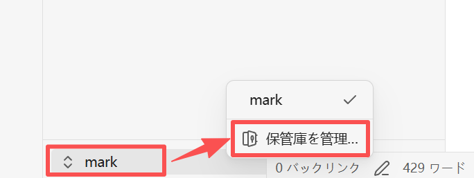

# Obsidian + Quartz + GitHub Pages でナレッジベースを作成する完全ガイド

個人のナレッジベース(知識管理システム)を構築する最強の組み合わせを、ゼロから解説します。

## この構成の魅力

```
┌─────────────┐    ┌─────────────┐    ┌──────────────┐
│  Obsidian   │ →  │   Quartz    │ →  │ GitHub Pages │
│  (執筆)     │    │  (変換)      │    │   (公開)     │
└─────────────┘    └─────────────┘    └──────────────┘
   ローカルで         静的サイトに         世界中から
   快適に執筆         自動変換             アクセス可能
```

| 特徴 | メリット |
|------|---------|
| 💰 **完全無料** | サーバー代・ドメイン代不要 |
| 🔗 **双方向リンク対応** | Obsidian の `[[リンク]]` がそのまま機能 |
| 🕸️ **グラフビュー** | 知識のつながりを可視化 |
| 🔍 **全文検索** | 高速な日本語検索対応 |
| 🌙 **ダークモード** | 自動切替 |
| 📱 **レスポンシブ** | スマホでも快適 |

## 必要なもの

| ツール | 用途 | ダウンロード |
|--------|------|-------------|
| **Node.js** (v22以上) | Quartz の実行環境 | nodejs.org |
| **Git** | バージョン管理 | git-scm.com |
| **GitHub アカウント** | コードとサイトのホスティング | github.com |
| **Obsidian** | ノート編集 | obsidian.md |
| **VS Code**(任意) | 設定ファイル編集 | code.visualstudio.com |

### 環境チェック

ターミナル(Windows: PowerShell / Mac: Terminal)で確認:

```bash
node -v        # v22.x.x 以上
npm -v         # 10.x.x 以上
git --version  # 2.x.x 以上
```

## ステップ 1:Quartz のセットアップ

### 1-1. リポジトリのクローン

```bash
# 作業ディレクトリへ移動(例:デスクトップ)
cd ~/Desktop

# Quartz をクローン
git clone https://github.com/jackyzha0/quartz.git

# ディレクトリへ移動
cd quartz

# 依存関係をインストール(数分かかります)
npm install
```

### 1-2. Quartz の初期化

```bash
npx quartz create
```

3 つの質問に答えます:

```
? Choose how to initialize the content
  ❯ Empty Quartz                          ← おすすめ(空から始める)
    Copy an existing folder
    Symlink an existing folder

? Choose how Quartz should resolve links
  ❯ Treat links as shortest path           ← Obsidian と同じ動作
    Treat links as relative paths
    Treat links as absolute paths
```

### 1-3. ローカルでプレビュー

```bash
npx quartz build --serve
```

ブラウザで **http://localhost:8080** を開くと、デフォルトのウェルカムページが表示されます。

`Ctrl + C` でサーバーを停止できます。


## ステップ 2:Obsidian と連携する

Quartz の `content/` フォルダが、Obsidian の Vault(保管庫)になります。

### 2-1. Obsidian で Vault を開く

1. Obsidian を起動
2. 左下の ユーザー名をクリックし、**「保管庫を管理」**メニューをクリック
   
    
3. **「保管庫としてフォルダを開く」** → **「フォルダを選択」**
4. `quartz/content/` フォルダを選択

これで、Obsidian で書いたノートが自動的に Quartz プロジェクトに保存されます。

### 2-2. ディレクトリ構成の例

```
quartz/
├── content/                    ⭐ Obsidian Vault
│   ├── index.md                ← トップページ(必須)
│   ├── about.md                ← 自己紹介
│   ├── 📚 読書ノート/
│   │   ├── index.md
│   │   ├── 深い思考.md
│   │   └── アトミック・シンキング.md
│   ├── 💻 プログラミング/
│   │   ├── Python基礎.md
│   │   └── JavaScript入門.md
│   ├── 🎌 日本語学習/
│   │   └── 敬語の使い方.md
│   └── attachments/            ← 画像など
│       └── image.png
├── quartz.config.ts            ⭐ メイン設定ファイル
├── quartz.layout.ts            ⭐ レイアウト設定
└── package.json
```

### 2-3. トップページの作成

`content/index.md` は必ず作成します:

```markdown
---
title: マイ・ナレッジベース
---

# ようこそ 👋

ここは私の個人ナレッジベースです。
読書ノート、プログラミング学習、日々の気づきをまとめています。

## 主なコンテンツ

- [[📚 読書ノート/index|読書ノート]]
- [[💻 プログラミング/index|プログラミング]]
- [[🎌 日本語学習/index|日本語学習]]

## 最近更新したノート

- [[深い思考]]
- [[Python基礎]]

## 連絡先

- GitHub: [@yourname](https://github.com/yourname)
- Twitter: [@yourname](https://twitter.com/yourname)
```

### 2-4. Obsidian の便利な機能を活用

```markdown
---
title: 深い思考(Deep Work)
tags:
  - 読書ノート
  - 生産性
date: 2026-04-29
draft: false           # true にすると公開されない
---

# 深い思考

カル・ニューポート著の名作。

## 重要な概念

- [[集中力]] を高める方法
- [[マルチタスク]] の罠
- ![[集中力グラフ.png]]   ← 画像埋め込み

## 引用

> [!quote] 重要な引用
> 深い仕事こそが、現代における超能力である。

## コードサンプル

```python
def focus_mode():
    return "深い集中状態"
```

## 数式(LaTeX)

生産性は \( P = T \times I \) で表される。
ここで \( T \) は時間、\( I \) は集中度。


## ステップ 3:設定のカスタマイズ
`quartz.config.ts` を開いて編集します。

### 3-1. 基本設定

```typescript
const config: QuartzConfig = {
  configuration: {
    pageTitle: "マイ・ナレッジベース",         // ⭐ サイトタイトル
    pageTitleSuffix: "",
    enableSPA: true,
    enablePopovers: true,                       // ホバーでプレビュー
    analytics: {
      provider: "plausible",                    // または "google", null
    },
    locale: "ja-JP",                            // ⭐ 日本語ロケール
    baseUrl: "ユーザー名.github.io/quartz",     // ⭐ サイトの URL
    ignorePatterns: [
      "private",                                 // 非公開フォルダ
      "templates",
      ".obsidian",                               // Obsidian の設定
      ".trash",                                  // ゴミ箱
    ],
    defaultDateType: "modified",
    theme: {
      fontOrigin: "googleFonts",
      cdnCaching: true,
      typography: {
        header: "Noto Serif JP",                // ⭐ 日本語見出しフォント
        body: "Noto Sans JP",                   // ⭐ 日本語本文フォント
        code: "JetBrains Mono",
      },
      colors: {
        lightMode: {
          light: "#faf8f8",
          lightgray: "#e5e5e5",
          gray: "#b8b8b8",
          darkgray: "#4e4e4e",
          dark: "#2b2b2b",
          secondary: "#284b63",                  // テーマカラー
          tertiary: "#84a59d",
          highlight: "rgba(143, 159, 169, 0.15)",
        },
        darkMode: {
          light: "#161618",
          lightgray: "#393639",
          gray: "#646464",
          darkgray: "#d4d4d4",
          dark: "#ebebec",
          secondary: "#7b97aa",
          tertiary: "#84a59d",
          highlight: "rgba(143, 159, 169, 0.15)",
        },
      },
    },
  },
  // ...
}
```

### 3-2. 重要な設定項目

| 項目 | 説明 | 例 |
|------|------|-----|
| `pageTitle` | サイトタイトル | `"マイ・ナレッジベース"` |
| `baseUrl` | サイト URL(https:// なし) | `"yourname.github.io/quartz"` |
| `locale` | 言語ロケール | `"ja-JP"` |
| `ignorePatterns` | 公開しないフォルダ | `["private", ".obsidian"]` |
| `typography` | フォント設定 | 上記参照 |

### 3-3. 日本語に最適化されたフォント

```typescript
typography: {
  // パターン 1:モダン・洗練
  header: "Noto Sans JP",
  body: "Noto Sans JP",
  code: "JetBrains Mono",

  // パターン 2:伝統的・読みやすい
  // header: "Noto Serif JP",
  // body: "Noto Serif JP",
  // code: "Source Code Pro",

  // パターン 3:ブログ風
  // header: "M PLUS Rounded 1c",
  // body: "M PLUS 1p",
  // code: "Fira Code",
},
```

## ステップ 4:GitHub にプッシュ

### 4-1. GitHub リポジトリを作成

1. https://github.com/new にアクセス
2. リポジトリ名:`quartz`(または好きな名前)
3. **Public** を選択(無料の GitHub Pages には公開リポジトリが必要)
4. README は **追加しない**
5. 「Create repository」をクリック  

### 4-2. コードをプッシュ

```bash
cd ~/Desktop/quartz

# リモートを再設定(クローンした場合)
git remote remove origin
git remote add origin https://github.com/ユーザー名/quartz.git

# コミット & プッシュ
git add .
git commit -m "初回コミット:ナレッジベースの構築"
git branch -M v4
git push -u origin v4
```

⚠️ Quartz v4 は `v4` ブランチを使います。

## ステップ 5:GitHub Pages の自動デプロイを設定

### 5-1. ワークフローファイルを作成

`.github/workflows/deploy.yml` を作成:

```yaml
name: Deploy Quartz site to GitHub Pages

on:
  push:
    branches:
      - v4

permissions:
  contents: read
  pages: write
  id-token: write

concurrency:
  group: "pages"
  cancel-in-progress: false

jobs:
  build:
    runs-on: ubuntu-22.04
    steps:
      - uses: actions/checkout@v4
        with:
          fetch-depth: 0
      - uses: actions/setup-node@v4
        with:
          node-version: 22
      - name: Install Dependencies
        run: npm ci
      - name: Build Quartz
        run: npx quartz build
      - name: Upload artifact
        uses: actions/upload-pages-artifact@v3
        with:
          path: public

  deploy:
    needs: build
    environment:
      name: github-pages
      url: ${{ steps.deployment.outputs.page_url }}
    runs-on: ubuntu-latest
    steps:
      - name: Deploy to GitHub Pages
        id: deployment
        uses: actions/deploy-pages@v4
```

### 5-2. プッシュ

```bash
git add .github/workflows/deploy.yml
git commit -m "GitHub Pages のデプロイワークフローを追加"
git push
```

### 5-3. GitHub Pages を有効化

1. リポジトリの **Settings** → 左メニューの **Pages**
2. **Source** で **GitHub Actions** を選択
3. 保存

### 5-4 一発公開
下記のコマンドでpull + commit + push を一括実行
```bash
npx quartz sync
```

### 5-5. デプロイの確認

1. リポジトリの **Actions** タブをクリック
2. ワークフローが実行中(黄色 🟡)
3. 2〜5 分後に成功(緑色 ✅)
4. **https://ユーザー名.github.io/quartz** にアクセス

🎉 **公開完了!**

デプロイ失敗の場合、re-runしてみてください。

## ステップ 6:日々の運用フロー

```
┌──────────────────────────────────────────────┐
│  毎日のワークフロー                           │
└──────────────────────────────────────────────┘

    1. Obsidian でノートを書く
              ↓
    2. ターミナルで quartz ディレクトリへ
              ↓
    3. (任意)ローカルプレビュー
       npx quartz build --serve
              ↓
    4. 一発公開コマンド
       npx quartz sync
              ↓
    5. GitHub Actions が自動デプロイ(2〜5 分)
              ↓
    6. サイトが更新される 🎉
```

### 便利なコマンド一覧

| コマンド | 機能 |
|---------|------|
| `npx quartz build` | サイトをビルド |
| `npx quartz build --serve` | ビルド + ローカルサーバー起動 |
| `npx quartz sync` | pull + commit + push を一括実行 |
| `npx quartz update` | Quartz を最新版に更新 |

最もよく使うのは **`npx quartz sync`** です。

## ステップ 7:レイアウトのカスタマイズ

`quartz.layout.ts` を編集してレイアウトを調整:

```typescript
export const defaultContentPageLayout: PageLayout = {
  beforeBody: [
    Component.Breadcrumbs(),                  // パンくずリスト
    Component.ArticleTitle(),                  // 記事タイトル
    Component.ContentMeta(),                   // メタ情報(日付・文字数)
    Component.TagList(),                       // タグ一覧
  ],
  left: [                                      // ⭐ 左サイドバー
    Component.PageTitle(),
    Component.MobileOnly(Component.Spacer()),
    Component.Search(),                        // 検索ボックス
    Component.Darkmode(),                      // ダークモード切替
    Component.DesktopOnly(Component.Explorer()), // ファイルツリー
  ],
  right: [                                     // ⭐ 右サイドバー
    Component.Graph(),                          // グラフビュー
    Component.DesktopOnly(Component.TableOfContents()), // 目次
    Component.Backlinks(),                      // バックリンク
  ],
}
```

## ステップ 8:Obsidian の機能対応状況

| Obsidian の機能 | Quartz でのサポート |
|----------------|-------------------|
| `[[双方向リンク]]` | ✅ 完全対応 |
| `[[ノート\|表示名]]` | ✅ |
| `![[ノート埋め込み]]` | ✅ |
| `![[画像.png]]` | ✅ |
| `#タグ` | ✅ タグページも自動生成 |
| `> [!note] コールアウト` | ✅ |
| `==ハイライト==` | ✅ |
| Mermaid 図 | ✅ |
| LaTeX 数式 | ✅(プラグイン有効化が必要) |
| フロントマター | ✅ |
| グラフビュー | ✅ インタラクティブ |
| バックリンク | ✅ |
| ホバープレビュー | ✅ |

## 上級編:カスタマイズ

### 独自ドメインの設定

`example.com` のような独自ドメインを使う場合:

#### 1. CNAME ファイル作成

`quartz/static/CNAME` を作成:

```
notes.example.com
```

#### 2. DNS 設定

ドメイン管理画面で:

```
Type:  CNAME
Name:  notes
Value: ユーザー名.github.io
```

#### 3. GitHub Pages の設定

Settings → Pages → Custom domain にドメイン入力 → **Enforce HTTPS** にチェック

#### 4. baseUrl を更新

```typescript
baseUrl: "notes.example.com",
```

### 数式(LaTeX)の有効化

`quartz.config.ts` の `plugins.transformers` に追加:

```typescript
Plugin.Latex({ renderEngine: "katex" }),
```

これで以下が動作します:

```markdown
インライン:\( E = mc^2 \)

ブロック:
$$
\int_{-\infty}^{\infty} e^{-x^2} dx = \sqrt{\pi}
$$
```

### RSS フィードを有効化

```typescript
Plugin.ContentIndex({
  enableSiteMap: true,
  enableRSS: true,        // ← RSS を有効化
}),
```

`https://yoursite.com/index.xml` で RSS が利用可能になります。

### 非公開ノートの管理

3 つの方法があります:

**方法 1:フロントマターで指定**

```markdown
---
draft: true             # 公開しない
---
```

**方法 2:設定ファイルで除外**

```typescript
ignorePatterns: ["private", "日記", ".obsidian"],
```

**方法 3:そもそも `content/` 外に置く**

## トラブルシューティング

### Q1. プッシュ後、サイトが更新されない

**Actions** タブで状態を確認:
- ❌ 赤:ビルド失敗 → ログを確認
- 🟡 黄:ビルド中 → 待つ
- ✅ 緑:成功 → ブラウザのキャッシュをクリア(`Ctrl + Shift + R`)

### Q2. 日本語の検索ができない

`quartz.config.ts` で:

```typescript
locale: "ja-JP",
```

を確認。デフォルトの検索エンジン(FlexSearch)は日本語にも対応しています。

### Q3. 画像が表示されない

- `content/` 内に画像を配置(`content/attachments/image.png` など)
- Obsidian 風(`![[image.png]]`)または Markdown 風(``)で参照

### Q4. ビルドが遅い・失敗する

```bash
# 依存関係を再インストール
rm -rf node_modules package-lock.json
npm install

# キャッシュをクリアして再ビルド
npx quartz build --concurrency=4
```

### Q5. Quartz を最新版に更新したい

```bash
npx quartz update
```

または手動で:

```bash
git remote add upstream https://github.com/jackyzha0/quartz.git
git fetch upstream
git merge upstream/v4
```

### Q6. 日本語フォルダ名が文字化けする

Git の設定を確認:

```bash
git config --global core.quotepath false
```

## 推奨ディレクトリ構成

実際に使いやすい構成例:

```
content/
├── index.md                    # トップページ
├── about.md                    # 自己紹介
│
├── 📚 読書ノート/
│   ├── index.md
│   ├── ビジネス/
│   │   ├── 7つの習慣.md
│   │   └── 思考の整理学.md
│   └── 技術書/
│       └── リーダブルコード.md
│
├── 💻 プログラミング/
│   ├── index.md
│   ├── Python/
│   │   ├── 基礎.md
│   │   └── ライブラリ.md
│   └── Web開発/
│       └── React入門.md
│
├── 🎌 日本語/
│   ├── 敬語.md
│   └── 慣用句.md
│
├── 💭 アイデア/                # 走り書き
│   └── 雑記.md
│
├── 📝 日記/                    # 非公開
│   └── 2026-04-29.md
│
└── attachments/                # 画像
    └── images/
```

`ignorePatterns: ["📝 日記"]` で日記フォルダだけ非公開にできます。

## 学習リソース

| リソース | URL |
|---------|-----|
| Quartz 公式ドキュメント | quartz.jzhao.xyz |
| Quartz GitHub | github.com/jackyzha0/quartz |
| Obsidian 公式 | obsidian.md |
| Obsidian 日本語ヘルプ | publish.obsidian.md/help-ja |

## おすすめの進め方

| 期間 | やること |
|------|---------|
| **1 週目** | 基本セットアップ、既存ノートの移行 |
| **2 週目** | デザイン調整(色・フォント・レイアウト) |
| **3 週目** | トップページ・自己紹介ページの作成 |
| **4 週目** | 独自ドメインの設定(任意) |
| **継続** | 「書いたら sync」を習慣化 |

## まとめ

```
Obsidian で書く → Quartz で変換 → GitHub Pages で公開
─────────────────────────────────────────────────────
       快適                 自動            無料
```

この組み合わせなら、**マークダウンで書くだけ**で、世界中からアクセス可能な美しいナレッジベースが完成します。

セットアップで詰まったら、エラーメッセージを教えてください。トラブルシューティングをお手伝いします!

何か特定の部分(配色のカスタマイズ、独自ドメイン設定、Obsidian プラグインとの連携など)について詳しく知りたいことはありますか?